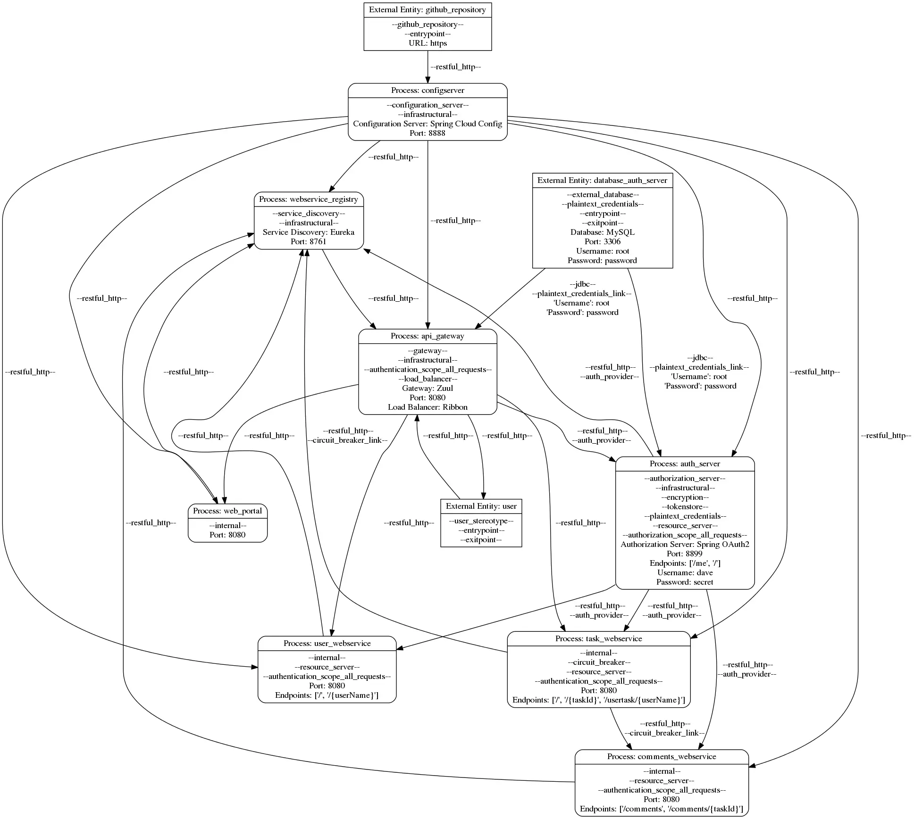

## General Information

The repository for this application ([open on GitHub](https://github.com/rohitghatol/spring-boot-microservices)) has 1680 stars and was forked 913 times. The codebase consists of 2328 lines of code and makes use of the following technologies:

<a class="btn btn-primary" style="margin-bottom: 5px" role="button" href="tag_docker_compose.html">Docker Compose</a>
<a class="btn btn-primary" style="margin-bottom: 5px" role="button" href="tag_eureka.html">Eureka</a>
<a class="btn btn-primary" style="margin-bottom: 5px" role="button" href="tag_gradle.html">Gradle</a>
<a class="btn btn-primary" style="margin-bottom: 5px" role="button" href="tag_hystrix.html">Hystrix</a>
<a class="btn btn-primary" style="margin-bottom: 5px" role="button" href="tag_ribbon.html">Ribbon</a>
<a class="btn btn-primary" style="margin-bottom: 5px" role="button" href="tag_spring_config.html">Spring Config</a>
<a class="btn btn-primary" style="margin-bottom: 5px" role="button" href="tag_spring_oauth.html">Spring OAuth</a>
<a class="btn btn-primary" style="margin-bottom: 5px" role="button" href="tag_zuul.html">Zuul</a>

## Data Flow Diagram



Download the following model file [here](https://github.com/tuhh-softsec/microSecEnD/blob/main/dataset/rohitghatol_spring-boot-microservices/rohitghatol_spring-boot-microservices.json).
Other formats are provided below.

```json
{
    "services": [
        {
            "name": "configserver",
            "stereotypes": [
                "configuration_server",
                "infrastructural"
            ],
            "tagged_values": {
                "Configuration Server": "Spring Cloud Config",
                "Port": 8888
            }
        },
        {
            "name": "webservice_registry",
            "stereotypes": [
                "service_discovery",
                "infrastructural"
            ],
            "tagged_values": {
                "Service Discovery": "Eureka",
                "Port": 8761
            }
        },
        {
            "name": "auth_server",
            "stereotypes": [
                "authorization_server",
                "infrastructural",
                "encryption",
                "tokenstore",
                "plaintext_credentials",
                "resource_server",
                "authorization_scope_all_requests"
            ],
            "tagged_values": {
                "Authorization Server": "Spring OAuth2",
                "Port": 8899,
                "Endpoints": [
                    "/me",
                    "/"
                ],
                "Username": "dave",
                "Password": "secret"
            }
        },
        {
            "name": "web_portal",
            "stereotypes": [
                "internal"
            ],
            "tagged_values": {
                "Port": 8080
            }
        },
        {
            "name": "user_webservice",
            "stereotypes": [
                "internal",
                "resource_server",
                "authentication_scope_all_requests"
            ],
            "tagged_values": {
                "Port": 8080,
                "Endpoints": [
                    "/",
                    "/{userName}"
                ]
            }
        },
        {
            "name": "comments_webservice",
            "stereotypes": [
                "internal",
                "resource_server",
                "authentication_scope_all_requests"
            ],
            "tagged_values": {
                "Port": 8080,
                "Endpoints": [
                    "/comments",
                    "/comments/{taskId}"
                ]
            }
        },
        {
            "name": "task_webservice",
            "stereotypes": [
                "internal",
                "circuit_breaker",
                "resource_server",
                "authentication_scope_all_requests"
            ],
            "tagged_values": {
                "Port": 8080,
                "Endpoints": [
                    "/",
                    "/{taskId}",
                    "/usertask/{userName}"
                ]
            }
        },
        {
            "name": "api_gateway",
            "stereotypes": [
                "gateway",
                "infrastructural",
                "authentication_scope_all_requests",
                "load_balancer"
            ],
            "tagged_values": {
                "Gateway": "Zuul",
                "Port": 8080,
                "Load Balancer": "Ribbon"
            }
        }
    ],
    "external_entities": [
        {
            "name": "github_repository",
            "stereotypes": [
                "github_repository",
                "entrypoint"
            ],
            "tagged_values": {
                "URL": "https://github.com/anilallewar/sample-config"
            }
        },
        {
            "name": "database_auth_server",
            "stereotypes": [
                "external_database",
                "plaintext_credentials",
                "entrypoint",
                "exitpoint"
            ],
            "tagged_values": {
                "Database": "MySQL",
                "Port": 3306,
                "Username": "root",
                "Password": "password"
            }
        },
        {
            "name": "user",
            "stereotypes": [
                "user_stereotype",
                "entrypoint",
                "exitpoint"
            ],
            "tagged_values": {}
        }
    ],
    "information_flows": [
        {
            "sender": "github_repository",
            "receiver": "configserver",
            "stereotypes": [
                "restful_http"
            ],
            "tagged_values": {}
        },
        {
            "sender": "configserver",
            "receiver": "webservice_registry",
            "stereotypes": [
                "restful_http"
            ],
            "tagged_values": {}
        },
        {
            "sender": "database_auth_server",
            "receiver": "auth_server",
            "stereotypes": [
                "jdbc",
                "plaintext_credentials_link"
            ],
            "tagged_values": {
                "'Username'": "\"root\"",
                " 'Password'": "\"password\""
            }
        },
        {
            "sender": "configserver",
            "receiver": "auth_server",
            "stereotypes": [
                "restful_http"
            ],
            "tagged_values": {}
        },
        {
            "sender": "auth_server",
            "receiver": "webservice_registry",
            "stereotypes": [
                "restful_http",
                "auth_provider"
            ],
            "tagged_values": {}
        },
        {
            "sender": "configserver",
            "receiver": "web_portal",
            "stereotypes": [
                "restful_http"
            ],
            "tagged_values": {}
        },
        {
            "sender": "web_portal",
            "receiver": "webservice_registry",
            "stereotypes": [
                "restful_http"
            ],
            "tagged_values": {}
        },
        {
            "sender": "configserver",
            "receiver": "user_webservice",
            "stereotypes": [
                "restful_http"
            ],
            "tagged_values": {}
        },
        {
            "sender": "user_webservice",
            "receiver": "webservice_registry",
            "stereotypes": [
                "restful_http"
            ],
            "tagged_values": {}
        },
        {
            "sender": "auth_server",
            "receiver": "user_webservice",
            "stereotypes": [
                "restful_http",
                "auth_provider"
            ],
            "tagged_values": {}
        },
        {
            "sender": "configserver",
            "receiver": "comments_webservice",
            "stereotypes": [
                "restful_http"
            ],
            "tagged_values": {}
        },
        {
            "sender": "comments_webservice",
            "receiver": "webservice_registry",
            "stereotypes": [
                "restful_http"
            ],
            "tagged_values": {}
        },
        {
            "sender": "auth_server",
            "receiver": "comments_webservice",
            "stereotypes": [
                "restful_http",
                "auth_provider"
            ],
            "tagged_values": {}
        },
        {
            "sender": "task_webservice",
            "receiver": "webservice_registry",
            "stereotypes": [
                "restful_http",
                "circuit_breaker_link"
            ],
            "tagged_values": {}
        },
        {
            "sender": "auth_server",
            "receiver": "task_webservice",
            "stereotypes": [
                "restful_http",
                "auth_provider"
            ],
            "tagged_values": {}
        },
        {
            "sender": "configserver",
            "receiver": "task_webservice",
            "stereotypes": [
                "restful_http"
            ],
            "tagged_values": {}
        },
        {
            "sender": "task_webservice",
            "receiver": "comments_webservice",
            "stereotypes": [
                "restful_http",
                "circuit_breaker_link"
            ],
            "tagged_values": {}
        },
        {
            "sender": "user",
            "receiver": "api_gateway",
            "stereotypes": [
                "restful_http"
            ],
            "tagged_values": {}
        },
        {
            "sender": "api_gateway",
            "receiver": "user",
            "stereotypes": [
                "restful_http"
            ],
            "tagged_values": {}
        },
        {
            "sender": "api_gateway",
            "receiver": "auth_server",
            "stereotypes": [
                "restful_http",
                "auth_provider"
            ],
            "tagged_values": {}
        },
        {
            "sender": "database_auth_server",
            "receiver": "api_gateway",
            "stereotypes": [
                "jdbc",
                "plaintext_credentials_link"
            ],
            "tagged_values": {
                "'Username'": "\"root\"",
                " 'Password'": "\"password\""
            }
        },
        {
            "sender": "api_gateway",
            "receiver": "user_webservice",
            "stereotypes": [
                "restful_http"
            ],
            "tagged_values": {}
        },
        {
            "sender": "api_gateway",
            "receiver": "task_webservice",
            "stereotypes": [
                "restful_http"
            ],
            "tagged_values": {}
        },
        {
            "sender": "api_gateway",
            "receiver": "web_portal",
            "stereotypes": [
                "restful_http"
            ],
            "tagged_values": {}
        },
        {
            "sender": "configserver",
            "receiver": "api_gateway",
            "stereotypes": [
                "restful_http"
            ],
            "tagged_values": {}
        },
        {
            "sender": "webservice_registry",
            "receiver": "api_gateway",
            "stereotypes": [
                "restful_http"
            ],
            "tagged_values": {}
        }
    ]
}
```

### Model Items

The Application consists of a total of 137 elements:

Element | Count
-- | --
Services | 8
External Entities | 3
Information Flows | 26
Annotations | 100
Total Items | 137

### Model Representations {#representations}

Open the model in the following formats:

- [JSON model](https://github.com/tuhh-softsec/microSecEnD/blob/main/dataset/rohitghatol_spring-boot-microservices/rohitghatol_spring-boot-microservices.json)
- [PlantUML description](https://github.com/tuhh-softsec/microSecEnD/blob/main/dataset/rohitghatol_spring-boot-microservices/rohitghatol_spring-boot-microservices.txt)
- [PNG graph](https://github.com/tuhh-softsec/microSecEnD/blob/main/dataset/rohitghatol_spring-boot-microservices/rohitghatol_spring-boot-microservices.png)
- [CodeableModels](https://github.com/tuhh-softsec/microSecEnD/blob/main/dataset/rohitghatol_spring-boot-microservices/rohitghatol_spring-boot-microservices.py)

### Traceability

Open the traceability information for all model items:

- [Traceability](https://github.com/tuhh-softsec/microSecEnD/blob/main/dataset/rohitghatol_spring-boot-microservices/rohitghatol_spring-boot-microservices_traceability.json)

## Security Rules

The following table shows the application's adherence to the 17 architectural security rules. The last column provides model variants that adhere to the rule for each rule that is initially violated.

Rule ID &nbsp;&nbsp;| Verdict &nbsp;&nbsp;&nbsp;&nbsp;&nbsp;| Evidence &nbsp;&nbsp;&nbsp;&nbsp;&nbsp;&nbsp;| Model Variant &nbsp;&nbsp;&nbsp;|
-- | -- | -- | -- |
**R1** | <i class="fa fa-warning" style="color: #bfc600;"> | <a href="#rule01">Evidence |  |
**R2** | <i class="fa fa-check-square-o" style="color: #6be16d;"></i> | <a href="#rule02">Evidence |  |
**R3** | <i class="fa fa-check-square-o" style="color: #6be16d;"></i> | <a href="#rule03">Evidence |  |
**R4** | <i class="fa fa-exclamation-circle" style="color: #d72b28;"> | <a href="#rule04">Evidence | [Variant](https://github.com/tuhh-softsec/microSecEnD/blob/main/dataset/rohitghatol_spring-boot-microservices/model_variants/4.txt) |
**R5** | <i class="fa fa-check-square-o" style="color: #6be16d;"></i> | <a href="#rule05">Evidence |  |
**R6** | <i class="fa fa-exclamation-circle" style="color: #d72b28;"> | <a href="#rule06">Evidence | [Variant](https://github.com/tuhh-softsec/microSecEnD/blob/main/dataset/rohitghatol_spring-boot-microservices/model_variants/6.txt) |
**R7** | <i class="fa fa-exclamation-circle" style="color: #d72b28;"> | <a href="#rule07">Evidence | [Variant](https://github.com/tuhh-softsec/microSecEnD/blob/main/dataset/rohitghatol_spring-boot-microservices/model_variants/7.txt) |
**R8** | <i class="fa fa-exclamation-circle" style="color: #d72b28;"> | <a href="#rule08">Evidence | [Variant](https://github.com/tuhh-softsec/microSecEnD/blob/main/dataset/rohitghatol_spring-boot-microservices/model_variants/8.txt) |
**R9** | <i class="fa fa-exclamation-circle" style="color: #d72b28;"> | <a href="#rule09">Evidence | [Variant](https://github.com/tuhh-softsec/microSecEnD/blob/main/dataset/rohitghatol_spring-boot-microservices/model_variants/9.txt) |
**R10** | <i class="fa fa-exclamation-circle" style="color: #d72b28;"> | <a href="#rule10">Evidence | [Variant](https://github.com/tuhh-softsec/microSecEnD/blob/main/dataset/rohitghatol_spring-boot-microservices/model_variants/10.txt) |
**R11** | <i class="fa fa-exclamation-circle" style="color: #d72b28;"> | <a href="#rule11">Evidence | [Variant](https://github.com/tuhh-softsec/microSecEnD/blob/main/dataset/rohitghatol_spring-boot-microservices/model_variants/11.txt) |
**R12** | <i class="fa fa-exclamation-circle" style="color: #d72b28;"> | <a href="#rule12">Evidence | [Variant](https://github.com/tuhh-softsec/microSecEnD/blob/main/dataset/rohitghatol_spring-boot-microservices/model_variants/12.txt) |
**R13** | <i class="fa fa-check-square-o" style="color: #6be16d;"></i> | <a href="#rule13">Evidence |  |
**R14** | <i class="fa fa-check-square-o" style="color: #6be16d;"></i> | <a href="#rule14">Evidence |  |
**R16** | <i class="fa fa-check-square-o" style="color: #6be16d;"></i> | <a href="#rule16">Evidence |  |
**R17** | <i class="fa fa-exclamation-circle" style="color: #d72b28;"> | <a href="#rule17">Evidence | [Variant](https://github.com/tuhh-softsec/microSecEnD/blob/main/dataset/rohitghatol_spring-boot-microservices/model_variants/17.txt) |
**R18** | <i class="fa fa-exclamation-circle" style="color: #d72b28;"> | <a href="#rule18">Evidence | [Variant](https://github.com/tuhh-softsec/microSecEnD/blob/main/dataset/rohitghatol_spring-boot-microservices/model_variants/18.txt) |


### Evidence and explanations for rule decisions

#### R1 {#rule01}

This rule is unknown:
1. The @EnableZuulProxy annotation is present,
1. The @EnableOAuth2Sso annotation is present,
1. No routing to the authorization server as mentioned by author, thus no single entrypoint.

Artifacts:
- Application.java: Lines: [51](https://github.com/rohitghatol/spring-boot-microservices/blob/master/api-gateway/src/main/java/com/rohitghatol/microservice/gateway/Application.java#L51), [53](https://github.com/rohitghatol/spring-boot-microservices/blob/master/api-gateway/src/main/java/com/rohitghatol/microservice/gateway/Application.java#L53)
- api-gateway.yml: Line: [15](https://github.com/anilallewar/sample-config/blob/master/api-gateway.yml#L15)

#### R2  {#rule02}

Rule is adhered to:
1. The @EnableOAuth2Resource annotation is present at downstream services,
1. Endpoint at authorization server in yml for authentication and authorization.

Artifacts:
- Application.java: Line: [47](https://github.com/rohitghatol/spring-boot-microservices/blob/master/task-webservice/src/main/java/com/rohitghatol/microservices/task/Application.java#L47)
- Application.java: Line: [41](https://github.com/rohitghatol/spring-boot-microservices/blob/master/comments-webservice/src/main/java/com/rohitghatol/microservices/comments/Application.java#L41)
- Application.java: Line: [40](https://github.com/rohitghatol/spring-boot-microservices/blob/master/user-webservice/src/main/java/com/rohitghatol/microservices/user/Application.java#L40)
- ResourceServerConfiguration.java: Line: [22](https://github.com/rohitghatol/spring-boot-microservices/blob/master/auth-server/src/main/java/com/rohitghatol/microservice/auth/config/ResourceServerConfiguration.java#L22)
- comments-webservice.yml: Line: [16](https://github.com/anilallewar/sample-config/blob/master/comments-webservice.yml#L16)

#### R3 {#rule03}

This rule is unknown:
1. The @EnableAuthorizationServer annotation is present,
1. No JwtAccessTokenConverter present, hence using opaque token,
1. Endpoint for validating token and user present

Artifacts:
- OAuthConfiguration.java: Line: [29](https://github.com/rohitghatol/spring-boot-microservices/blob/master/auth-server/src/main/java/com/rohitghatol/microservice/auth/config/OAuthConfiguration.java#L29)
- AuthUserController.java: Line: [24](https://github.com/rohitghatol/spring-boot-microservices/blob/master/auth-server/src/main/java/com/rohitghatol/microservice/auth/api/AuthUserController.java#L24)

#### R4 {#rule04}

This rule is unknown: As rule 2 already confirms that every downstream service needs tokens for authorization/authentication. However, no evidence of tokens transferred to internal identity representations.

#### R5 {#rule05}

Rule is adhered to: Tokens are validated based on the endpoint at the auth server.

Artifacts:
- comments-webservice.yml: Line: [16](https://github.com/anilallewar/sample-config/blob/master/comments-webservice.yml#L16)

#### R6 {#rule06}

Rule is violated: No blocking mechanism in place for multiple failed login attempts.


#### R7 {#rule07}

Rule is violated: No mention of SSL, TLS, keystores or trust-stores in application.

#### R8 {#rule08}

Rule is violated: See rule 7.


#### R9 {#rule09}

Rule is violated: No central logging system is deployed.

#### R10 {#rule10}

Rule is violated: See rule 9.

#### R11 {#rule11}

Rule is violated: See rule 9.

#### R12 {#rule12}

Rule is violated: See rule 9.


#### R13 {#rule13}

Rule is adhered to: The @EnableZuulProxy annotation enables Hystrix and its circuit breaker functionality.

Artifacts:
- Application.java: Line: [51](https://github.com/rohitghatol/spring-boot-microservices/blob/master/api-gateway/src/main/java/com/rohitghatol/microservice/gateway/Application.java#L51)

#### R14 {#rule14}

Rule is adhered to: The @EnableZuulProxy annotation enables Ribbon and its load balancing functionality.

Artifacts:
- Application.java: Line: [51](https://github.com/rohitghatol/spring-boot-microservices/blob/master/api-gateway/src/main/java/com/rohitghatol/microservice/gateway/Application.java#L51)

#### R15 {#rule15}

This rule is not applicable: Not a service mesh deployment.


#### R16 {#rule16}

Rule is adhered to:
1. Registry Service (Eureka Server) with @EnableEurekaServer present.
1. Started in Docker Container through Compose, thus deployable on dedicated server

Artifacts:
- Application.java: Line: [24](https://github.com/rohitghatol/spring-boot-microservices/blob/master/webservice-registry/src/main/java/com/rohitghatol/microservices/registry/Application.java#L24)
- docker-compose.yml: Line: [5](https://github.com/rohitghatol/spring-boot-microservices/blob/master/docker-compose.yml#L5)

#### R17 {#rule17}

Rule is violated: No HTTP basic password listed in any YML-Configuration of format username:password@here-location-of-eureka-server at "eureka.client.serviceUrl.defaultZone".

Artifacts:
- comments-webservice.yml: Line: [26](https://github.com/anilallewar/sample-config/blob/master/comments-webservice.yml#L26)


#### R18 {#rule18}

Rule is violated: No secret manager is deployed.
